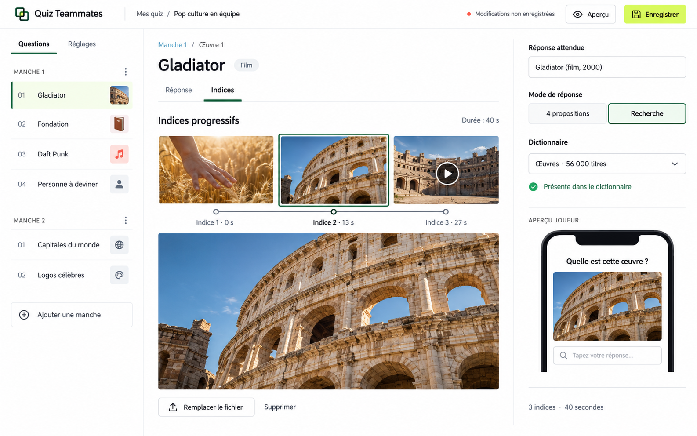
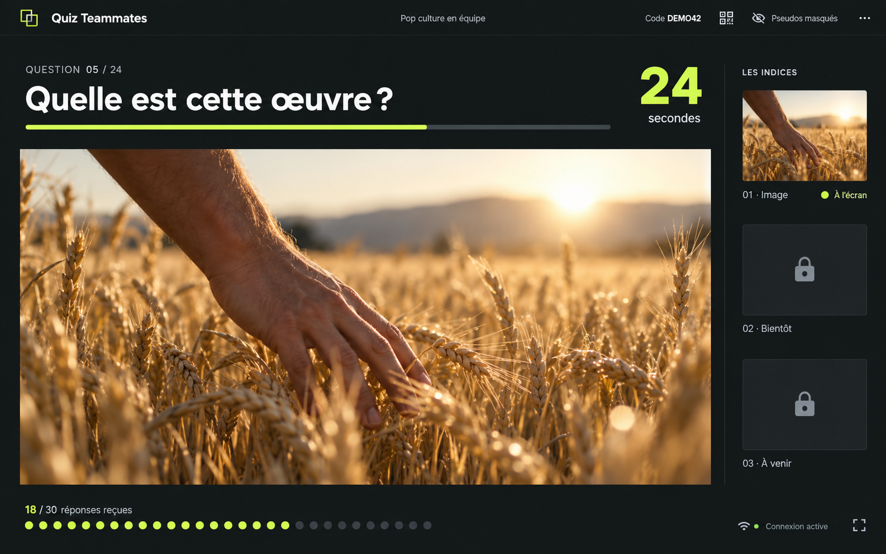
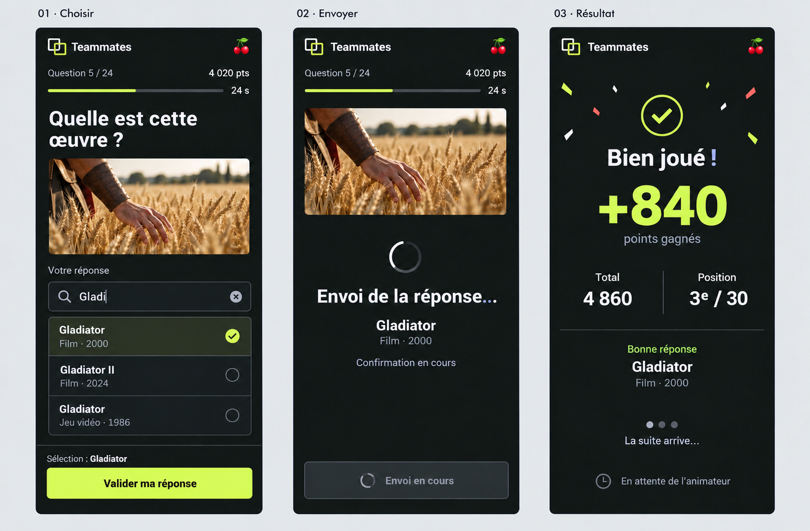
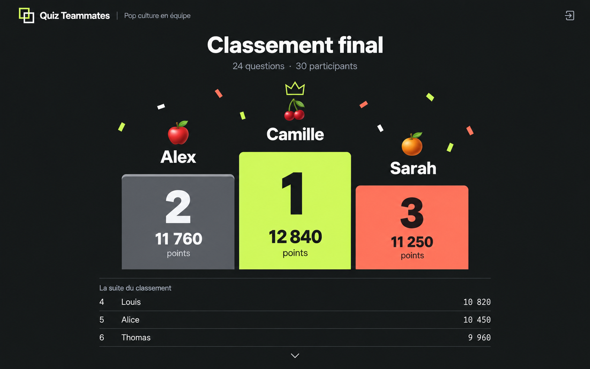

# Audit graphique de Quiz Teammates

Date : 6 octobre 2026. Version examinée : `31563ad`.

## Diagnostic

Le produit a une identité ludique, mais sa présentation reste dominée par les contenants : cadres imbriqués, bordures, boutons de poids comparable et nombreuses zones de texte en gras. Les changements de thème modifient surtout les couleurs ; ils ne résolvent pas cette hiérarchie. La création, la projection et le téléphone doivent partager une identité tout en ayant des compositions différentes.

La proposition est une direction **Studio** : une interface de création claire, des écrans de jeu anthracite, une couleur citron pour l'action principale et le score, du corail pour les accents. Les indices et les réactions deviennent les éléments expressifs. Les cadres et les ombres passent au second plan.

## Périmètre et méthode

- Captures de l'application Angular locale, avec les composants et les CSS existants, dans Chrome piloté par Playwright.
- Données de démonstration injectées uniquement dans le navigateur ; les appels métier sont interceptés. Les captures ne représentent pas une vraie partie ni des comptes réels.
- Cosmic : accueil, bibliothèque, éditeur, salon, question et révélation animateur, question et résultat joueur.
- Academy : comparaison du premier écran de l'éditeur. Orbit et Arcade : lecture des règles CSS, sans validation visuelle complète.
- Bureau : 1440 × 1000. Mobile : 390 × 844, sans clavier logiciel ouvert.
- Mesures : hauteur du document, débordement horizontal et calcul de contraste à partir des couleurs CSS. Ce travail n'est pas un audit exhaustif d'accessibilité ni un test utilisateur.

Captures et script reproductible : [dossier Playwright](../../../output/playwright/audit-graphique/). Mesures brutes : [metrics.json](../../../output/playwright/audit-graphique/metrics.json).

## Constats prioritaires

| Priorité | Constat vérifié | Effet | Proposition |
| --- | --- | --- | --- |
| Haute | Le formulaire neuf avec une seule œuvre produit une page de 2 576 px. Le premier contenu d'œuvre arrive près du bas du premier écran de 1 000 px. | L'utilisateur voit les réglages généraux avant le travail qu'il veut faire ; le formulaire paraît lourd. | Navigation des questions à gauche, édition d'une question au centre, propriétés à droite. Déplacer les réglages du quiz dans un onglet dédié. |
| Haute | Sur mobile, la question de démonstration fait 910 px pour une fenêtre de 844 px. Le bouton de validation est partiellement sous le premier écran. | L'action principale est pénalisée par la marque répétée, « Participation », le code et l'avatar empilés. | En-tête de deux lignes maximum, zone d'indices compacte, suggestions bornées et barre de validation stable tenant compte du clavier. |
| Haute | La question animateur fait 1 177 px pour une fenêtre de 1 000 px, avec un seul indice. | Le média dépasse le bas de la projection. Plusieurs couches de marges et de cadres réduisent l'espace utile. | Scène dimensionnée à la fenêtre, média en `object-fit: contain`, compteur et progression compacts, indices précédents dans un rail. |
| Haute | Le texte blanc sur la couleur primaire Cosmic `#d84fc6` donne environ 3,59:1 ; sur Academy `#ed9946`, environ 2,27:1. | Les boutons principaux manquent de contraste pour leur texte courant à 16 px, même en gras. | Texte sombre sur les accents lumineux et paires de couleurs validées dans chaque état. |
| Moyenne | La bibliothèque affiche cinq actions textuelles par quiz, dont certaines passent sur une deuxième ligne. | Le titre du quiz entre en concurrence avec les commandes ; les lignes sont irrégulières. | Garder « Lancer » en primaire, l'édition en secondaire et regrouper duplication, export et suppression dans un menu. |
| Moyenne | La marque, les salutations, les titres génériques et les explications se répètent dans des zones déjà identifiables. | Beaucoup de hauteur consommée sans faire avancer la tâche. | Un titre contextuel par écran et des métadonnées sobres. Conserver l'aide utile au voisinage du champ concerné. |
| Moyenne | Beaucoup de graisses 750–950, cadres et couleurs intermédiaires proches dans Cosmic. | Presque tout semble important ; l'ensemble reste visuellement uniforme. | Corps 400–500, labels 500–600, titres 650–700 ; trois niveaux de surface, séparateurs ponctuels, icônes cohérentes. |

Les rapports ci-dessus portent sur les couleurs de base des boutons, pas sur une mesure pixel par pixel de chaque dégradé ou état. Le seuil WCAG AA est de 4,5:1 pour le texte courant et 3:1 pour le grand texte ; les contrôles inactifs sont exemptés. [Référence W3C](https://www.w3.org/WAI/WCAG22/Understanding/contrast-minimum.html).

Les textes secondaires Cosmic examinés ne sont pas tous en défaut : `#aeb7da` sur `#2d365f` donne environ 5,87:1. Il faut corriger les paires problématiques, pas éclaircir indistinctement tout le thème.

## Maquettes proposées

Ces images sont des propositions générées, pas des captures d'une refonte déjà intégrée. Leurs textes, noms et contenus sont fictifs. Les photographies d'indices illustrent le placement du média ; elles ne remplacent pas les fichiers du quiz. Les valeurs exactes, libellés secondaires et alignements seront définis dans les composants lors de l'implémentation.

### 1. Éditeur Studio



Une question active, un aperçu lisible des indices et une réponse attendue directement accessible. Les paramètres généraux du quiz passent dans « Réglages ». La liste latérale doit permettre de reconnaître le type et l'état de complétude d'une question. Les titres d'œuvres sont dérivés des réponses, sans réintroduire de champ « Personne cible » ou « Nom de manche » obligatoire.

La maquette représente trois indices ; leur ajout et leur suppression restent disponibles. Les modes quatre propositions et recherche sont conservés. Le réglage 40 s doit refléter le moteur actuel : l'image ne constitue pas une demande d'ajout d'une durée personnalisable.

### 2. Scène animateur Studio Live



L'indice occupe la scène, le temps se lit à distance et les réponses reçues restent visibles sans afficher les joueurs. Les indices futurs restent masqués. À l'apparition du suivant, le nouveau média prend la scène et l'ancien rejoint le rail ; l'animation ne doit ni rogner le média ni décaler les commandes.

Dans le salon d'attente, conserver le grand QR code et les pseudos de part et d'autre. En cours de partie, le code et l'accès au QR restent compacts dans le bandeau. Le QR stylisé de cette image est un pictogramme de maquette, pas un code utilisable.

### 3. Parcours joueur



La réponse choisie reste visible avant validation. Les suggestions occupent leur propre zone et ne couvrent pas le bouton. L'état d'envoi reste neutre jusqu'à la confirmation serveur. Une bonne réponse valorise les points gagnés, puis le total et la position personnelle, sans classement collectif pendant les questions.

L'écran de mauvaise réponse doit reprendre la même composition : symbole et libellé explicites, accent corail, « La bonne réponse était », zéro point gagné, total conservé. Le joueur attend la prochaine question lancée par l'animateur. Aucun bouton « Continuer » ne lui donne la main sur le déroulement.

L'état de recherche illustré sans clavier doit être complété par une vérification avec clavier ouvert, titre long, liste vide, réponse sélectionnée, requête lente et nouvelle question. Les états du moteur restent pilotés par les données serveur.

### 4. Podium final



Le podium garde l'ordre visuel 2–1–3 et les identités attribuées aux joueurs. La maquette montre le dernier état de la révélation : noms visibles, gagnant mis en évidence, suite du classement en dessous. Les positions inférieures doivent rester consultables par défilement.

La révélation animée reste chronologique 3, 2, 1 et synchronisée avec le serveur sur tous les écrans. Les identités cachées ne doivent pas apparaître dans la liste inférieure avant le moment prévu. Les confettis sont brefs et limités au résultat final ; ils ne couvrent pas les noms ni les scores.

## Règles visuelles à formaliser

| Élément | Cible proposée |
| --- | --- |
| Fonds | Création : blanc et gris neutre très clair. Jeu : anthracite `#171b1a`. |
| Couleur principale | Citron `#d5f45b` avec texte `#171b1a`, contraste théorique d'environ 14:1. |
| Texte de jeu | `#f6f7f8` sur anthracite, environ 16,21:1. |
| Couleurs de résultat | Vert avec coche et texte pour la réussite ; corail avec symbole et texte pour l'erreur. La couleur seule ne suffit pas. |
| Typographie | Une famille UI, tailles stables, chiffres tabulaires pour temps et scores. |
| Structure | Pas de panneau décoratif autour de toute la page. Bordures pour champs, séparation de colonnes et vrais outils encadrés. |
| Boutons | Une action primaire par zone ; icônes cohérentes et intitulés accessibles pour les commandes secondaires. |
| Animations | Retour tactile court ; changements d'état lisibles ; animation spectaculaire réservée aux moments du jeu. Respect de la préférence de réduction des animations. |

## Ordre de mise en œuvre proposé

1. Définir les couleurs sémantiques, la typographie, les surfaces et les états des contrôles. Réduire les règles de thème qui surchargent des sélecteurs spécifiques.
2. Recomposer la vue animateur et le téléphone : gain visuel immédiat sur les écrans les plus utilisés pendant une partie.
3. Refaire l'éditeur autour d'une seule question active ; conserver les validations et les deux modes de réponse.
4. Simplifier la bibliothèque et les dictionnaires avec la même hiérarchie d'actions.
5. Décliner le salon, les résultats et le podium ; vérifier les animations et la synchronisation existante.

## Critères de réception d'une future implémentation

- Indice complet et commandes essentielles visibles à 1366 × 768, 1440 × 900 et 1920 × 1080.
- Validation accessible à 390 × 844 et 360 × 800, y compris avec clavier et longue réponse.
- Pas de débordement horizontal ; zoom 200 % et noms longs pris en compte.
- Tous les états des contrôles lisibles dans les thèmes clair et sombre.
- Médias image, audio et vidéo vérifiés sans changement d'échelle gênant à chaque indice.
- Aucun retour correct/incorrect avant confirmation ; aucune identité révélée en avance.
- Édition, bibliothèque et dictionnaires utilisables au clavier ; dialogue et autocomplétion avec focus visible.

## Livrables et état

- [x] Audit visuel sur les écrans ciblés et lecture des styles.
- [x] Captures locales de référence et mesures.
- [x] Quatre maquettes image, dont une planche de trois états joueur.
- [x] Correction de la maquette joueur pour préserver l'avancement contrôlé par l'animateur.
- [x] [Prompts de génération](PROMPTS.md), outil intégré `image_gen`.
- [x] Choix de la direction Studio validé par l'utilisateur.
- [x] Implémentation dans l'application et validation locale dans Chrome piloté par Playwright.

## Intégration en cours

- [x] Fondations Studio, icônes et navigation.
- [x] Animateur, indices, salon et podium.
- [x] Joueur mobile, autocomplétion et états d'envoi.
- [x] Éditeur question par question, indices et validations.
- [x] Bibliothèque, dictionnaires et import.
- [x] Compilation et contrôles fonctionnels.
- [x] Captures et mesures bureau/mobile, corrections visuelles.

Les observations d'audit ci-dessus décrivent la version antérieure à l'intégration.

## Livraison Studio, 7 octobre 2026

Studio est le défaut côté client et serveur. La configuration locale et les exemples utilisent `APP_THEME=studio`. Sur un service Render existant, remplacer explicitement une ancienne valeur de cette variable après déploiement. Les quatre autres thèmes restent sélectionnables.

### Écrans intégrés

- Éditeur à trois zones : navigation des manches/questions, indices de la question active et réponses. Réglages généraux séparés, aperçu en dialogue, enregistrement accessible pendant le défilement.
- Ajout, suppression et duplication conservés ; une manche neuve commence toujours avec une seule œuvre, trois restent nécessaires à l'enregistrement.
- Sélection d'un indice, aperçu image/audio/vidéo, téléversement ou URL et chronologie 0 / 13 / 27 s pour trois indices.
- Ouverture automatique de la question portant la première erreur de validation ; formulaire verrouillé pendant l'enregistrement.
- Bibliothèque avec lancement principal, édition par icône et menu des actions secondaires ; import et dictionnaires harmonisés.
- Animateur : scène adaptée à la hauteur disponible, rail d'indices futurs masqués, consultation des indices déjà révélés, réponses reçues et plein écran.
- Salon conservant le grand QR, pseudos et réactions. Résultats animateur avec répartition bonnes/mauvaises réponses et top 5.
- Joueur : en-tête compact, total personnel, recherche avec sélection explicite, envoi neutre, confirmation puis résultat correct/incorrect. La sélection et la saisie sont réinitialisées au changement de question.
- Accusé tardif ignoré lorsque la question a changé. Aucun résultat erroné n'est affiché pendant l'attente du résultat serveur.
- Podium 2–1–3, animations basées sur l'heure de début reçue du serveur, révélation des identités conservée et confettis brefs. Réduction des animations respectée.
- Icônes Lucide et contrastes des boutons lumineux corrigés également dans Cosmic, Academy et Orbit.

Les maquettes restent des références de direction, pas des captures de l'application : l'aperçu joueur est disponible dans un dialogue plutôt qu'une miniature permanente dans la colonne des réponses.

### Vérifications

- `npm run typecheck` : réussi.
- `npm run build` : réussi, y compris le serveur. Avertissement non bloquant : paquet initial 668,44 ko pour un seuil d'avertissement de 614,40 ko (environ 164,88 ko transférés). Le seuil n'a pas été relevé pour masquer cet avertissement.
- `npm run test:timing` : 3 tests réussis (durée de 40 s, indices progressifs, révélation finale).
- Chrome / Playwright : aucune exception navigateur ni débordement horizontal sur les vues capturées.
- Animateur testé à 1366 × 768, 1440 × 900 et 1920 × 1080 : indice complet et commandes visibles sans défilement vertical.
- Joueur testé à 390 × 844, 360 × 800 et fenêtre réduite à 390 × 480. Recherche, sélection, validation, envoi lent, attente du score, résultat positif/négatif, QCM et personne testés.
- Lecture effective des fichiers audio et vidéo locaux ; image vidéo décodée contrôlée comme non vide.
- Tests éditeur : ajout d'œuvres et d'indices, retrait, aperçu et fermeture clavier, réglages, enregistrement lent et navigation vers une erreur d'une autre question.
- Révélation des identités sur deux vues avec le même horaire serveur : états à 0 / 1,2 / 3,5 / 6,5 / 10 / 13,5 s vérifiés.
- Éditeur dans les quatre anciens thèmes, version mobile repliable, affichage étroit équivalent à un zoom bureau de 200 %, animateur et podium mobiles avec animations réduites.

### Mesures comparatives

| Écran | Avant | Studio |
| --- | --- | --- |
| Éditeur neuf, bureau 1440 × 1000 | Document de 2576 px | 1000 px |
| Question animateur | 1177 px pour une fenêtre de 1000 px | 768 px à 1366 × 768, 900 px à 1440 × 900 |
| Question joueur, 390 × 844 | Document de 910 px | 844 px, validation dans l'écran |

### Captures et reproduction

- [Galerie des écrans intégrés](../../../output/playwright/studio/index.html)
- [Rapport des mesures](../../../output/playwright/studio/report.json)
- [Scénario de vérification](../../../output/playwright/studio/verify.mjs)

Avec le serveur local sur le port 4200, Node 20, Chrome et les dépendances Playwright de `performance/` installées :

```bash
node output/playwright/studio/verify.mjs
```

Ce scénario utilise trois médias présents localement dans `contenu_quizz/` : `louis/gladiator/gladiator_01.png`, `alice/Stardew valley/01.mp3` et `alice/Blade Runner/02.mp4`. Il ne contacte pas Firebase pour les opérations métier et ne modifie pas les quiz existants.

Limites : fenêtres mobiles simulées dans Chrome, pas de test sur appareil physique ni de vrai clavier iOS/Android. Le test à 390 × 480 est une approximation de la hauteur disponible avec clavier. Le zoom est vérifié par une largeur CSS équivalente, pas par le réglage natif du navigateur. Authentification Google, téléversement Cloudinary réel et charge Render non retestés dans cette passe graphique.

## Complément : libellés longs et reprise des salons

- [x] Autocomplétion : lignes non compressibles, libellés sur plusieurs lignes, mots longs sécables et texte complet au survol. La liste défile sans tronquer le contenu de ses éléments.
- [x] Plus de hauteur pour la liste sur mobile, tout en conservant une liste compacte dans une fenêtre basse avec clavier.
- [x] Texte de la réponse sélectionnée intégral, y compris le récapitulatif au-dessus du bouton de validation.
- [x] Onglet « Quiz en cours » : états attente/question/réponse, progression et date, reprise, actualisation, chargement, erreur et liste vide.
- [x] Rattachement animateur après restauration de session, nouvelle tentative après erreur et reconnexion réseau ; sortie propre du salon.
- [x] Vérification Playwright à 1440 × 1000 et 360 × 800, longues réponses de plus de 200 caractères et mots sans espaces, sélection clavier et souris. Les cinq thèmes sont vérifiés côté joueur, sans débordement horizontal ni exception navigateur.
- [x] Scénario Studio existant relancé : éditeur, médias, réponses, résultats, synchronisation des identités et animations réduites passent.
- [x] 4 tests de reprise/propriété et 3 tests de rythme réussis. L'accès anonyme à la liste des salons retourne 401 sur le serveur local.
- [x] Compilation client/serveur réussie. Paquet initial désormais de 685,86 ko (environ 169,16 ko transférés), avec l'avertissement de budget de 614,40 ko toujours présent.

La logique du délai est testée sans Firestore réel ; les parcours navigateur simulent les services. Aucune partie Render ni aucun compte Firebase réel n'a été modifié pour ces contrôles.

Reproduction : `node output/playwright/resume-rooms/verify.mjs`, dans les mêmes conditions locales que le scénario Studio. [Rapport et liste des captures](../../../output/playwright/resume-rooms/report.json).
