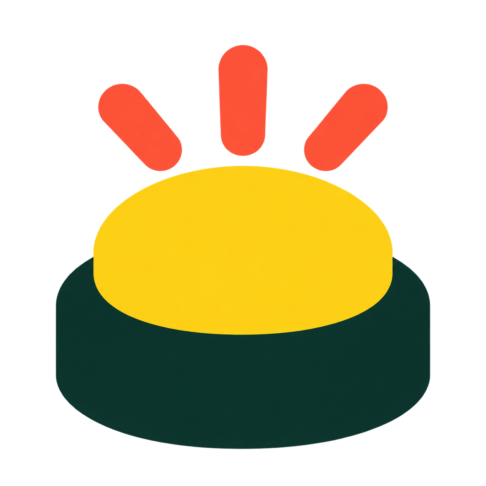

# Logo Buzzer retenu

Le 8 octobre 2026, l'utilisateur a choisi la proposition 5. La préparation du fond transparent utilise l'outil de génération d'images intégré, en conservant le bouton jaune, le socle vert sombre et les trois traits corail.

La source haute définition reste ici. `npm run favicon:generate` produit les fichiers légers dans `client/public/` : logo 128 px, favicon 32 px, ICO 16/32/48 px et icône mobile 180 px. Le bandeau affiche le logo en 32 px sans fond ajouté ; seule l'icône mobile a un fond opaque pour le masque du système.

## Consigne initiale

Use case: background-extraction. Edit the attached chosen Quiz Teammates BUZZER logo for production use as a website logo and favicon. Preserve the exact recognizable design: yellow oval domed button, very dark green rounded base, exactly three coral impulse rays above, same relative positions and proportions, no redesign. Remove ONLY the white background and any white halo; deliver TRUE transparent alpha behind and between all shapes, not a checkerboard painted into the image. Clean solid flat fills matching the reference colors, crisp contours. Fit the COMPLETE buzzer and rays prominently within a square canvas with only about 5 percent transparent margin on each side, without cropping any part of the symbol. No text, no added shapes, no tile, no frame, no shadow or glow. This is the chosen logo, keep it faithful, merely prepare a clean transparent production asset.

## Nettoyage

Edit the attached transparent buzzer logo with one precise cleanup only: remove ALL stray colored speckles and residue floating between or around the three coral rays, especially the red flecks between the middle and right ray. The final image must contain ONLY the four clean disconnected visible components: the three coral rounded rays and the joined yellow-button/dark-green-base silhouette. Outside these four exact shapes, every pixel must be fully transparent. Inside shapes, clean consistent opaque solid fills, no texture or mottling. Preserve the silhouette, relative positions, margins, geometry and colors of the attached logo. No added outline, no shadow, no glow, no checkerboard painted in. True transparent background. Crisp professional flat logo edges, faithful to this approved design.
