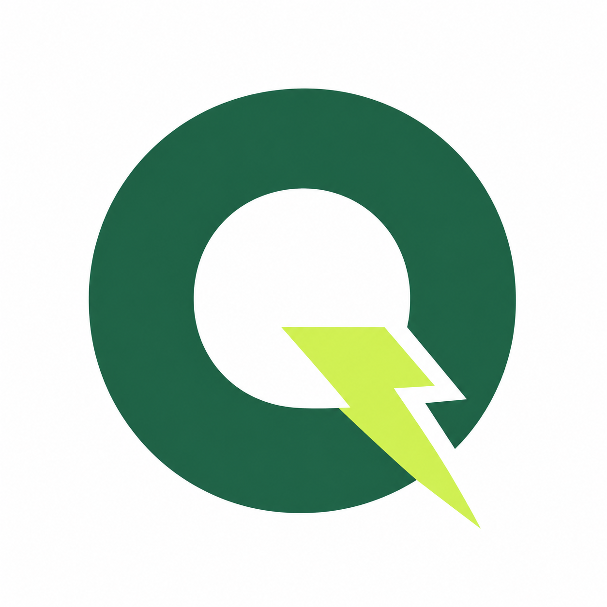
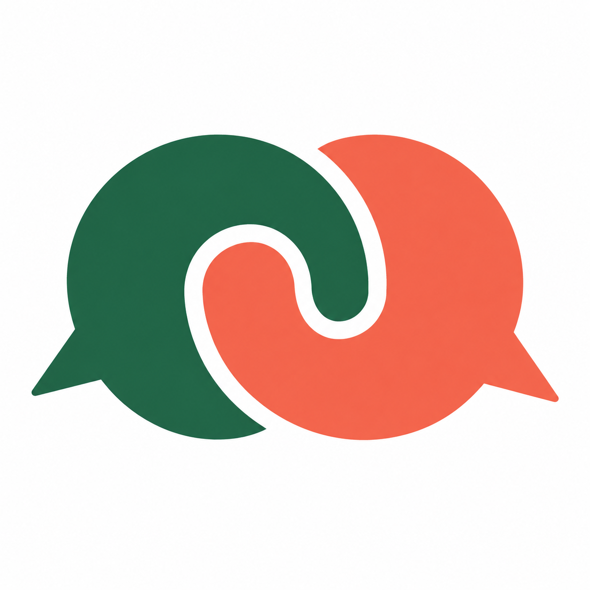
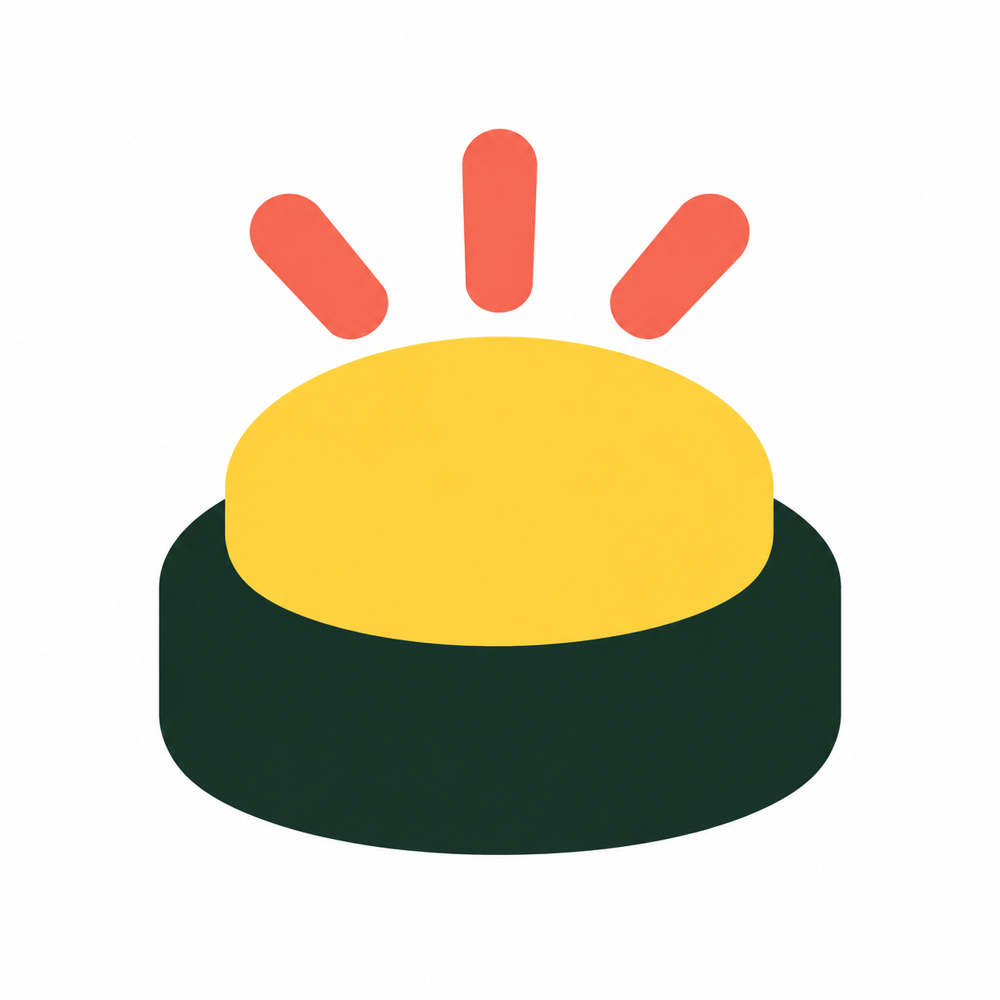

# Propositions de logo Quiz Teammates

8 octobre 2026. Cinq pistes créées avec l'outil de génération d'images intégré. L'utilisateur a choisi la proposition 5 « Buzzer ». Les autres propositions restent archivées ici.

La source transparente retenue et ses déclinaisons sont documentées dans `../buzzer/README.md`.

## 1. Déclic

### Consigne de génération

Use case: logo-brand. Create ONE polished logo concept for Quiz Teammates, a social culture guessing quiz where players recognize works and connect them to a teammate. Candidate 1: DECLIC. A striking, extremely simple custom capital Q as a thick solid circular mark, with the Q tail constructed as one clean lightning-bolt cut. Intelligent negative space, instantly recognizable silhouette. Deep forest green #216446 main Q and electric lime #D5F45B lightning tail, only these two solid colors. Flat vector-like graphic rendered as a high-quality bitmap, precise clean edges. Favicon-first: must remain readable at 16 and 32 pixels, no thin lines, no tiny detail. One isolated centered symbol occupying about 65 percent of a square image, plain pure white background. No wordmark, no caption, no typography other than the actual Q symbol, no numbers, no frames, no mockup, no 3D, no gradients, no shadows, no decorative objects, no overlapping cards. Original professional brand identity, confident and playful.

## 2. Complices

### Consigne de génération

Use case: logo-brand. Create ONE original polished logo concept for Quiz Teammates, a multiplayer guessing game about cultural works and the colleagues connected to them. Candidate 2: COMPLICES. Two bold, interlocking circular speech bubbles facing opposite directions, cleverly arranged as one compact connected symbol conveying conversation, teamwork, and friendly rivalry. One bubble deep forest green #216446, the other vivid warm coral #F56B57. Beautifully balanced negative space and an immediately memorable chunky silhouette. The bubbles are solid shapes, NOT thin outlines, no dots or text inside, no rectangles or cards. Flat two-color vector-like brand design rendered as a bitmap, crisp precise edges, absolutely no texture, shading, lighting or gradient. Favicon-first: clearly readable at 16/32 px, minimal geometry, very large simple shapes. Single isolated centered symbol occupying around 65 percent of a square white canvas. No wordmark, no letters, no captions, no numbers, no mockups, no border, no shadows, no background decorations. Mature playful identity, not a generic messaging app screenshot.

## 3. Connexion

### Consigne de génération

Use case: logo-brand. Create ONE distinctive original brand symbol for Quiz Teammates, a guessing quiz whose unique mechanic connects three cultural works to one person. Candidate 3: CONNEXION. A compact triangular cluster of exactly THREE thick rounded interlocking links converging around ONE central circular negative space. The overall symbol should suggest connection, discovery and a team gathered together, a clever geometric knot with a strong clean silhouette. Two links deep forest green #216446 and one vivid sky blue #329DF4, central space clean white. Broad solid shapes with generous gaps. Original modern Swiss graphic-design quality, friendly rounded terminals, flat two-color vector-like bitmap, sharp clean contours. No fine detail, no tiny pictograms inside the links, no network diagram, no arrows, no biohazard symbol, no recycle symbol, no gradients or texture, no shadows or mockups. Favicon-first: designed to retain its simple recognizable form at 16/32 px. One centered isolated symbol at 65 percent of square plain white canvas. Absolutely no lettering, numbers, titles or border. It should be completely different from a Q, a speech bubble, or stacked cards.

## 4. La pièce manquante

### Consigne de génération

Use case: logo-brand. Design ONE original professional logo concept for Quiz Teammates, a cultural guessing game where clues reveal works and then a person. Candidate 4: LA PIECE MANQUANTE. A bold compact puzzle emblem: one deep forest green #216446 block representing a nearly complete square puzzle, and ONE electric lime #D5F45B chunky puzzle piece slightly detached at the upper right, precisely fitting the missing corner. Large familiar rounded jigsaw connector, generous white separation, simple silhouette, no internal grid, no extra pieces, no detail inside. The lime piece completes the square visually. The geometry should feel expertly balanced and distinctive, friendly but not childish. Solid flat two-color vector-style logo rendered as high-quality bitmap. White background. Favicon-first with bold geometry and no delicate lines, readable at 16/32 px. One centered symbol filling about 65 percent of a square composition. No letters, no words, no numbers, no captions, no border, no gradients, no shadows, no texture, no 3D, no mockups, no unrelated decoration. Not overlapping cards, not speech bubbles, not a Q.

## 5. Buzzer

### Consigne de génération

Use case: logo-brand. Create ONE original professional logo concept for Quiz Teammates, a lively multiplayer quiz. Candidate 5: BUZZER. An extremely bold minimal arcade quiz buzzer viewed straight on at a slight elevated angle: a bright warm yellow #FFD34E domed push button seated on one chunky very dark green #172D25 rounded base. Above it, three short thick coral #F56B57 impulse rays suggest the instant someone buzzes in. The button top is a simple smooth filled shape, no smaller buttons, no cables, no text. Distinctive joyful retro arcade visual identity, compact nearly square silhouette, instantly recognizable at favicon sizes 16/32px. Flat solid colors and carefully controlled chunky geometry, vector-like brand graphic as bitmap. No photorealism, no highlights, no shading, no 3D render, no gradients, no shadows, no fine strokes or tiny decorations. One isolated centered symbol occupying around 65 percent of a square pure white background. No wordmark, no lettering, no numbers, no captions, no frame or mockup. Looks like a quiz buzzer, not a service bell: no bell knob and no bell flange.
